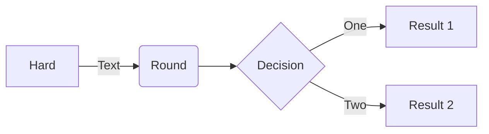
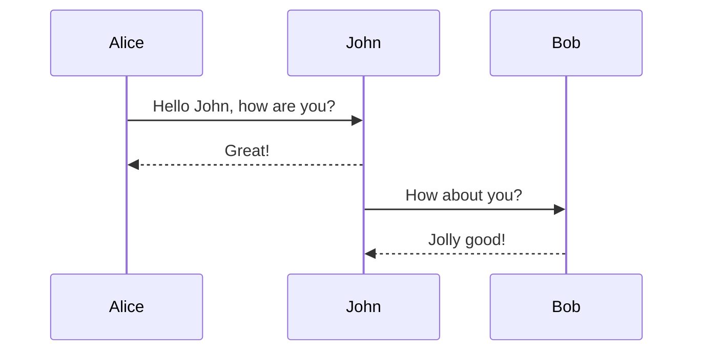
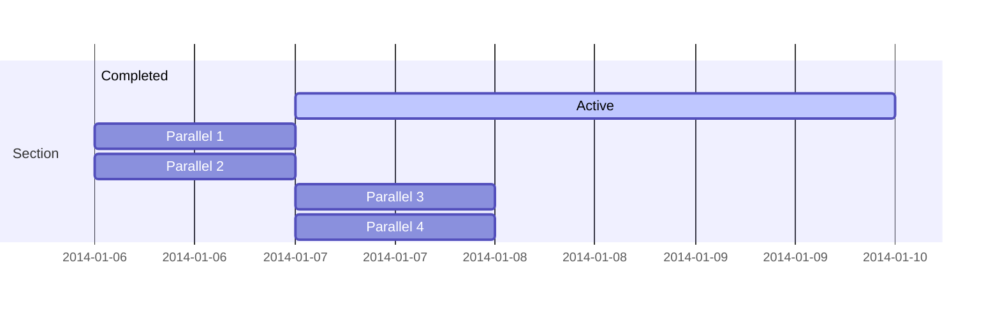
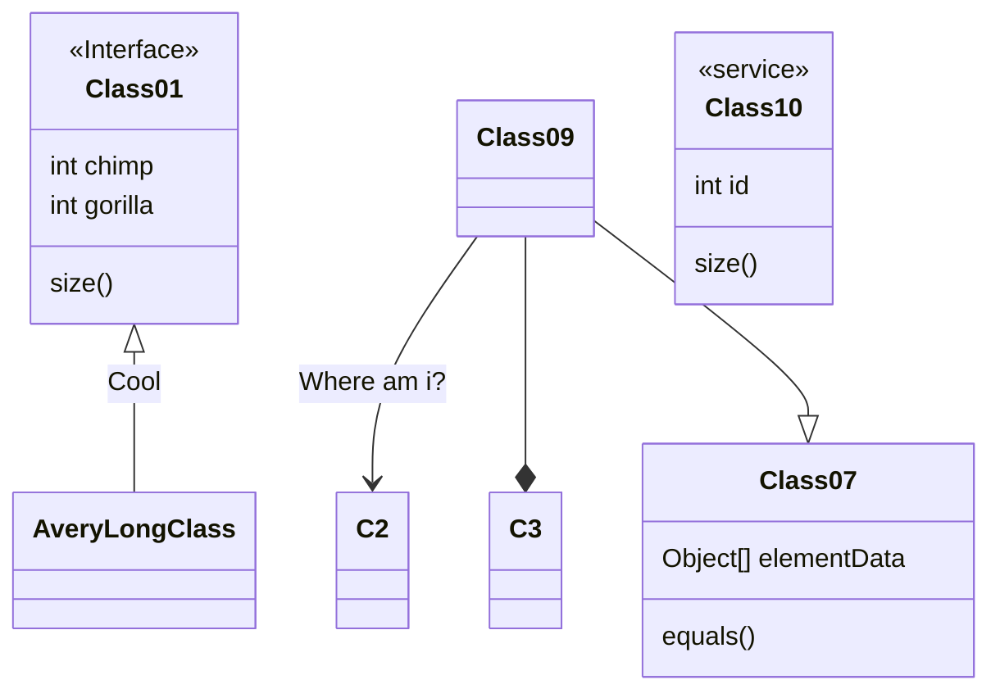
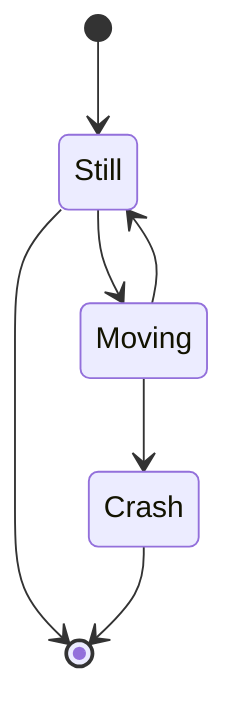
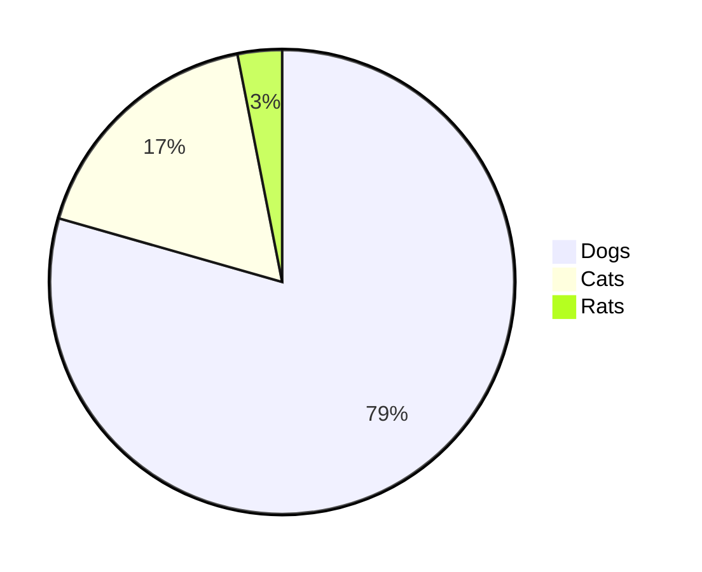

Flowchart
-----

```
flowchart LR

A[Hard] -->|Text| B(Round)
B --> C{Decision}
C -->|One| D[Result 1]
C -->|Two| E[Result 2]
```




Sequence Diagram
-----

````
sequenceDiagram
Alice->>John: Hello John, how are you?
loop Healthcheck
    John->>John: Fight against hypochondria
end
Note right of John: Rational thoughts!
John-->>Alice: Great!
John->>Bob: How about you?
Bob-->>John: Jolly good!
````



Gantt
-----

```
gantt
    section Section
    Completed :done,    des1, 2014-01-06,2014-01-08
    Active        :active,  des2, 2014-01-07, 3d
    Parallel 1   :         des3, after des1, 1d
    Parallel 2   :         des4, after des1, 1d
    Parallel 3   :         des5, after des3, 1d
    Parallel 4   :         des6, after des4, 1d
```



Class diagram
-----

```
classDiagram
Class01 <|-- AveryLongClass : Cool
<<Interface>> Class01
Class09 --> C2 : Where am i?
Class09 --* C3
Class09 --|> Class07
Class07 : equals()
Class07 : Object[] elementData
Class01 : size()
Class01 : int chimp
Class01 : int gorilla
class Class10 {
  <<service>>
  int id
  size()
}
```



State diagram
-----

```
stateDiagram-v2
[*] --> Still
Still --> [*]
Still --> Moving
Moving --> Still
Moving --> Crash
Crash --> [*]
```



Pie chart
-----

```
pie
"Dogs" : 386
"Cats" : 85
"Rats" : 15
```



User journey
-----

````
journey
title My working day
section Go to work
    Make tea: 5: Me
    Go upstairs: 3: Me
    Do work: 1: Me, Cat
section Go home
    Go downstairs: 5: Me
    Sit down: 3: Me
````

````mermaid
journey
title My working day
section Go to work
    Make tea: 5: Me
    Go upstairs: 3: Me
    Do work: 1: Me, Cat
section Go home
    Go downstairs: 5: Me
    Sit down: 3: Me
````