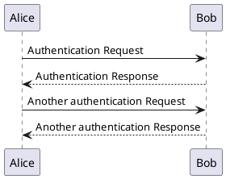
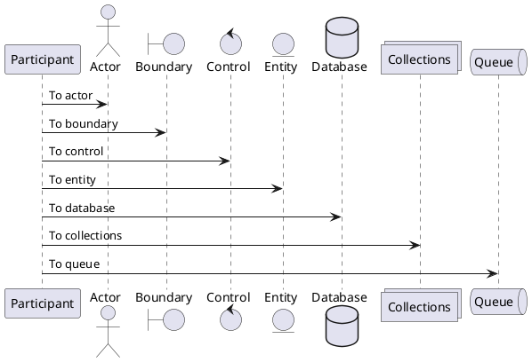
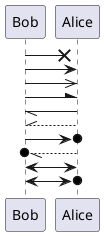
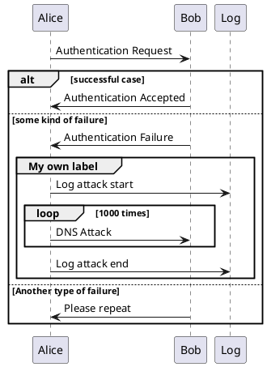
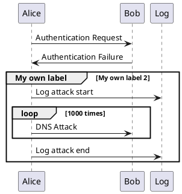

Sequence Diagram
-----

The sequence **->** is used to draw a message between two participants. Participants do not have to be explicitly declared.

To have a dotted arrow, you use **-->**

It is also possible to use **<-** and **<--**. That does not change the drawing, but may improve readability. Note that this is only true for sequence diagrams, rules are different for the other diagrams.

```
@startuml
Alice -> Bob: Authentication Request
Bob --> Alice: Authentication Response

Alice -> Bob: Another authentication Request
Alice <-- Bob: Another authentication Response
@enduml
```



Declaring participant
-----

If the keyword **participant** is used to declare a participant, more control on that participant is possible.

The order of declaration will be the (default) order of display.

Using these other *keywords* to declare participants will change the shape of the participant representation:

* actor
* boundary
* control
* entity
* database
* collections
* queue

```
@startuml
participant Participant as Foo
actor       Actor       as Foo1
boundary    Boundary    as Foo2
control     Control     as Foo3
entity      Entity      as Foo4
database    Database    as Foo5
collections Collections as Foo6
queue       Queue       as Foo7
Foo -> Foo1 : To actor 
Foo -> Foo2 : To boundary
Foo -> Foo3 : To control
Foo -> Foo4 : To entity
Foo -> Foo5 : To database
Foo -> Foo6 : To collections
Foo -> Foo7: To queue
@enduml
```



Change arrow style
-----

You can change arrow style by several ways:

* add a final **x** to denote a lost message
* use \ or / instead of < or > to have only the bottom or top part of the arrow
* repeat the arrow head (for example, >> or //) head to have a thin drawing
* use **--** instead of **-** to have a dotted arrow
* add a final **o** at arrow head
* use bidirectional arrow **<->**

```
@startuml
Bob ->x Alice
Bob -> Alice
Bob ->> Alice
Bob -\ Alice
Bob \\- Alice
Bob //-- Alice

Bob ->o Alice
Bob o\\-- Alice

Bob <-> Alice
Bob <->o Alice
@enduml
```



Grouping message
-----

It is possible to group messages together using the following keywords:
* alt/else
* opt
* loop
* par
* break
* critical
* group, followed by a text to be displayed

It is possible to add a text that will be displayed into the header (for group, see next paragraph 'Secondary group label').

The **end** keyword is used to close the group.

Note that it is possible to nest groups.

```
@startuml
Alice -> Bob: Authentication Request

alt successful case

    Bob -> Alice: Authentication Accepted

else some kind of failure

    Bob -> Alice: Authentication Failure
    group My own label
    Alice -> Log : Log attack start
        loop 1000 times
            Alice -> Bob: DNS Attack
        end
    Alice -> Log : Log attack end
    end

else Another type of failure

   Bob -> Alice: Please repeat

end
@enduml
```



Secondary group label 
-----

For **group**, it is possible to add, between **[** and **]**, a secondary text or label that will be displayed into the header.

```
@startuml
Alice -> Bob: Authentication Request
Bob -> Alice: Authentication Failure
group My own label [My own label 2]
    Alice -> Log : Log attack start
    loop 1000 times
        Alice -> Bob: DNS Attack
    end
    Alice -> Log : Log attack end
end
@enduml
```



More Examples
-----

More examples and information can be fount at [Plant UML](https://plantuml.com/).